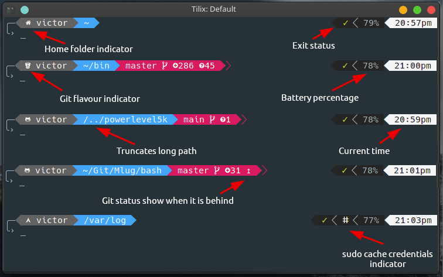

# powerlevel5k
A Bash prompt inspired by [powerlevel10k](https://github.com/romkatv/powerlevel10k).


Features
---

+ Folders
  + OS icon (manually set)
  + Home folder
  + Git flavour (GitHub, BitBucket)
  + DropBox
+ Current time
+ Git information
  + Branch
  + Changes (untracked  and modified )
  + Ahead/behind status
+ Exit status
+ Sudo cache credential
+ Truncates long path



Installation
---

Download `powerlevel5k.bash` to your machine (optionally make it hidden) and source it on your `${HOME}/.bashrc`.

```
. ${HOME}/.powerlevel5k.bash
```

#### Requirement

Additional fonts needed.

**Arch**

```
community/powerline-fonts
aur/nerd-fonts-complete
```

**Ubuntu**

```
apt install fonts-powerline
** nerd-fonts
```

Additional Options
---

You can change multiple options in the script. 

To disable the battery and sudo info change the two values to `n` in the script.

```
## Battery info
battery_info="y"

## Sudo info
sudo_info="y"
sudo_icon="ⵌ"  # Choose from: ⌚, ⏳, ✰, ⵌ, ✷, , ⚙

## Folders
default_folder_icon=""

# Folders
git_folder_icon=""
bitbucket_icon=""
github_icon=""
dropbox_icon=""
home_folder_icon=""
os_icon=""    # Choose from: , , , , , , , , , 
```